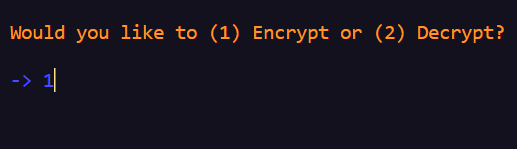
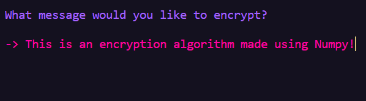
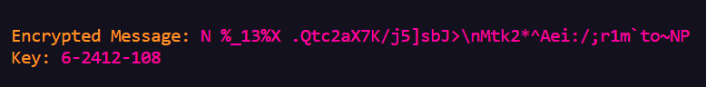
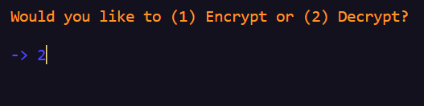
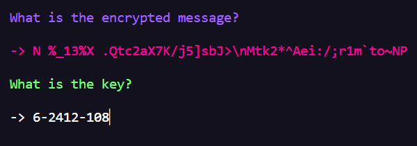

# **Encryption Algorithm Using Numpy**

---

## DO NOT USE THIS TO ENCRYPT AND STORE IMPORTANT TEXT. IT'S SECURITY HAS NOT BEEN TESTED.

---

**Dependencies:**

pip install charcade

pip install numpy

---

### **_How encryption works:_**

This is an encryption algorithm created using numpy.
Numpy is used to generate an array of numbers 0-94 that is organized in a 19 x 5 2D array.
the array is then shuffled up, down, left and right (kinda like a rubiks cube) a random number of times.

After the array is shuffled, the numbers are converted into a list and letters from the alphabet
are placed in their index position. After that the text that you input is ciphered using the generated
alphabet and the encrypted text and key are printed in the terminal.

---

---

---

---

### **_How decryption works:_**

The decryptor remakes the alphabet using 2 parts of the key and the third part of the key determines
the reverse shift in the cipher after the alphabet is reconstructed.

---

---

